#+TITLE: hax — Property-Based HTTP Axiom Tester
#+AUTHOR: aygp-dr
#+OPTIONS: toc:2 num:nil

[[https://img.shields.io/badge/status-experimental-orange.svg]]
[[https://img.shields.io/badge/go-1.23+-00ADD8.svg?logo=go]]
[[https://img.shields.io/badge/property--based%20testing-RFC%20grounded-blueviolet.svg]]
[[https://img.shields.io/badge/deps-zero-brightgreen.svg]]
[[https://img.shields.io/badge/license-MIT-blue.svg]]

* Overview

~hax~ generates HTTP request variants, applies structured mutations,
and checks RFC-grounded predicates to find compliance violations in
web services.

Unlike scanners (nuclei), fuzzers (ffuf), or proxies (burp), ~hax~
treats HTTP compliance as a property-testing problem:

#+begin_src mermaid :file model-architecture.svg :tangle model-architecture.mmd :exports results
flowchart LR
    subgraph gen["Request Generator"]
        direction TB
        G["<b>Axis Sampling</b> <i>method × path × headers auth × origin × repeat</i>"]
    end

    subgraph mut["Mutation Vocabulary"]
        direction TB
        M1["header-omit header-corrupt header-forge"]
        M2["method-rotate"]
        M3["origin-cross-site origin-same-site"]
        M4["repeat-N"]
        M5["repeat-concurrent"]
    end

    subgraph rel["Relevance Matrix"]
        R["<b>mutation → group routing</b> <i>constrains method, auth, repeat per mutation × predicate pair</i>"]
    end

    subgraph pred["Predicate Groups · 18 checks"]
        direction TB
        P1["<b>Headers</b> <i>CSP · HSTS · SameSite · CORP</i>"]
        P2["<b>Methods</b> <i>idempotency · safety · retries</i>"]
        P3["<b>Cross-Origin</b> <i>CSRF · CORS · JSONP · redirect</i>"]
        P4["<b>Cache</b> <i>ETag · no-store · Vary · 304</i>"]
        P5["<b>State</b> <i>workflow-skip · TOCTOU · replay</i>"]
    end

    subgraph orc["Verdict"]
        O["<b>Oracle</b> <i>pass / fail + shrink</i>"]
    end

    G --> M1 & M2 & M3 & M4 & M5

    M1 -->|"omit · corrupt · forge"| R
    M2 -->|"verb swap"| R
    M3 -->|"origin swap"| R
    M4 -->|"sequential replay"| R
    M5 -->|"concurrent replay"| R

    R -->|"header-*"| P1
    R -->|"method-rotate · repeat-N"| P2
    R -->|"origin-* · header-forge · method-rotate"| P3
    R -->|"repeat-N"| P4
    R -->|"repeat-N · repeat-concurrent"| P5

    P1 & P2 & P3 & P4 & P5 --> O

    style gen fill:#eeedfe,stroke:#534ab7,color:#3c3489
    style G fill:#eeedfe,stroke:#534ab7,color:#3c3489
    style mut fill:#eeedfe,stroke:#534ab7,color:#3c3489
    style M1 fill:#eeedfe,stroke:#534ab7,color:#3c3489
    style M2 fill:#eeedfe,stroke:#534ab7,color:#3c3489
    style M3 fill:#eeedfe,stroke:#534ab7,color:#3c3489
    style M4 fill:#eeedfe,stroke:#534ab7,color:#3c3489
    style M5 fill:#eeedfe,stroke:#534ab7,color:#3c3489
    style rel fill:#fef3e2,stroke:#b87a2a,color:#7a4f0f
    style R fill:#fef3e2,stroke:#b87a2a,color:#7a4f0f
    style pred fill:#e1f5ee,stroke:#0f6e56,color:#085041
    style P1 fill:#e1f5ee,stroke:#0f6e56,color:#085041
    style P2 fill:#e1f5ee,stroke:#0f6e56,color:#085041
    style P3 fill:#e1f5ee,stroke:#0f6e56,color:#085041
    style P4 fill:#e1f5ee,stroke:#0f6e56,color:#085041
    style P5 fill:#e1f5ee,stroke:#0f6e56,color:#085041
    style orc fill:#f1efe8,stroke:#5f5e5a,color:#444441
    style O fill:#f1efe8,stroke:#5f5e5a,color:#444441
#+end_src

#+RESULTS:

* Quick Start

#+begin_src bash
# Build
make build

# Quick compliance audit
./hax audit https://example.com

# See what's available
./hax list groups
./hax list mutations

# Full property-based test run
./hax run -t https://example.com

# JSON output for pipelines
./hax --json audit https://example.com
#+end_src

* Installation

#+begin_src bash
# From source
git clone https://github.com/aygp-dr/http-axiom.git
cd http-axiom
make install    # installs to ~/.local/bin/hax

# Cross-compile
make build-all  # outputs to dist/
#+end_src

* Architecture

** Request Generator

Produces HTTP request variants from the cartesian product of axes:

| Axis    | Values                                       |
|---------+----------------------------------------------|
| Method  | GET, POST, PUT, DELETE, PATCH, HEAD, OPTIONS |
| Path    | User-supplied list                           |
| Headers | Standard + custom                            |
| Auth    | none, bearer, basic, cookie                  |
| Origin  | omitted, same-site, cross-site               |
| Repeat  | single, N×, concurrent                       |

** Mutation Vocabulary

| Operator           | Effect                              |
|--------------------+-------------------------------------|
| method-rotate      | Cycle through HTTP methods          |
| header-omit        | Remove required headers             |
| header-corrupt     | Malform header values               |
| header-forge       | Inject forged headers (XFF, X-Real) |
| origin-cross-site  | Set cross-origin Origin header      |
| origin-same-site   | Set same-site Origin header         |
| repeat-N           | Replay request N times              |
| repeat-concurrent  | Replay request concurrently         |

** Predicate Groups

Five RFC-grounded predicate groups:

| Group        | Predicates                          |
|--------------+-------------------------------------|
| headers      | CSP, HSTS, SameSite, CORP           |
| methods      | idempotency, safety, retries        |
| cross-origin | CSRF, CORS, JSONP, redirect         |
| cache        | ETag, no-store, Vary, 304           |
| state        | workflow skip, TOCTOU, replay       |

** Oracle

Reports pass/fail verdicts. Uses Hegel-based shrinking to find
the smallest request that still triggers a failure.

* Commands

| Command             | Description                                |
|---------------------+--------------------------------------------|
| ~generate~ (~gen~)  | Generate HTTP request variants             |
| ~mutate~ (~mut~)    | Apply mutation operators to requests       |
| ~check~             | Run predicate checks against a target      |
| ~run~               | Full pipeline: generate → mutate → check   |
| ~list~ (~ls~)       | List predicates, mutations, groups, methods |
| ~audit~             | Quick compliance audit of an endpoint      |
| ~shrink~            | Minimize a failing test case               |
| ~doctor~            | Run diagnostic health checks               |
| ~quickstart~        | Onboarding context for agents              |
| ~version~           | Print version info                         |

* Global Flags

| Flag            | Description          |
|-----------------+----------------------|
| ~-t, --target~  | Target URL           |
| ~-V, --verbose~ | Verbose output       |
| ~--json~        | JSON output          |
| ~-v, --version~ | Print version        |
| ~-h, --help~    | Show help            |

* Project Layout

#+begin_example
main.go                      CLI entry point (hand-written arg routing)
go.mod                       Module (zero deps)
Makefile                     Build, test, lint, install
CLAUDE.md                    Agent coding context
AGENTS.md                    Agent development rules
internal/
  generator/generator.go     Request variant generation
  mutation/mutation.go       Mutation operators
  predicate/predicate.go     RFC-grounded predicate checks
  oracle/oracle.go           Verdict + shrinking
#+end_example

* Design Decisions

- *Zero dependencies* — Go stdlib only. No CLI frameworks.
- *Hand-written flag parsing* — follows [[https://github.com/jwalsh/sb][sb]] / [[https://github.com/jwalsh/cprr][cprr]] pattern.
- *Single binary* — cross-compiles to linux/darwin (amd64/arm64).
- *JSON output* — ~--json~ flag on all commands for pipeline integration.
- *Property-based* — not signature scanning, not random fuzzing.

* Test Targets

Two deliberately vulnerable targets for development and demos:

#+begin_src bash
# Built-in lightweight Go server (15 endpoints, all predicate groups)
make haxgoat          # starts on :9999
./hax audit http://localhost:9999
./hax audit http://localhost:9999/secure

# OWASP Juice Shop via Docker (real REST API + OpenAPI spec)
make juice-shop       # starts on :3000
./hax audit http://localhost:3000

# Auto-detect and audit whichever is running
make smoke
#+end_src

See ~cmd/haxgoat/main.go~ for the full endpoint manifest, or
query ~/manifest~ at runtime.

* Development

#+begin_src bash
make build       # Build with version info
make test        # Run tests
make test-race   # With race detector
make lint        # Vet + gofmt + golangci-lint
make smoke       # Audit against haxgoat or Juice Shop
make help        # All targets
#+end_src

* License

MIT
