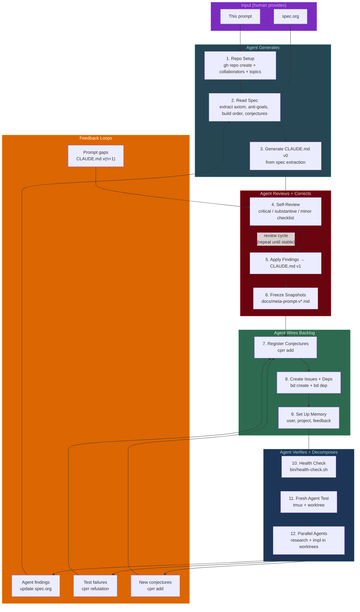
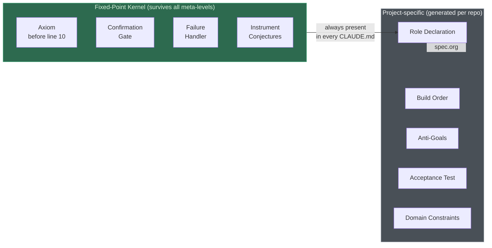

# Meta-Meta Prompt: Agent Bootstrap Protocol

## What This Is

An agent instruction for bootstrapping any new repository. Give this
to a Claude Code agent along with a `spec.org` file, and it will
produce the entire project scaffold: CLAUDE.md, issue backlog,
conjectures, health checks, and verification.

**This is not a human playbook. This is the prompt.**

## How to Use

```bash
# 1. Create repo and write your spec
mkdir my-project && cd my-project
git init && bd init && sb init && cprr init
# Write spec.org (your system's architecture)

# 2. Give this document to the agent
claude -p "$(cat docs/meta-meta-prompt.md)"
# The agent reads spec.org and does the rest.
```

## Process Overview





---

## Agent Instructions

You are a bootstrap agent. Your input is a `spec.org` file in the
current repository. Your job is to produce a complete project scaffold.

### Prerequisites

Verify these tools are available before starting:

```bash
git    # version control
gh     # GitHub CLI
bd     # beads issue tracker
sb     # worktree manager
cprr   # conjecture tracker
aq     # ambient agent queue (gossip layer for multi-agent coordination)
```

If any are missing, report which ones and stop.

Initialize aq and activate git hooks immediately:

```bash
aq init                           # creates ~/.aq, installs .githooks/
git config core.hooksPath .githooks  # activate aq pre/post-commit hooks
aq announce -c "bootstrap" -f "spec.org,CLAUDE.md"  # coordinator declares intent
```

### Step 1: Read the Spec

Read `spec.org` completely. Extract:

1. **Project name and subtitle**
2. **Foundational axiom** — the one sentence that survives context
   compression. Look for: the structural truth that explains why
   existing tools fail. Apply these tests:
   - *Inversion test*: What do failing tools optimize for? The axiom
     negates that.
   - *Degradation test*: What assumption breaks if AI improves 10x?
     The axiom should survive.
   - *Compression test*: If context shrinks to 500 tokens, which
     sentence must remain?
3. **Anti-goals** — what NOT to build. Name specific products or
   patterns. For each, state the mechanical failure mode (not just
   "it's bad" but "it degrades because X").
4. **Build order** — sequential steps with acceptance tests
5. **Open conjectures** — hypotheses with falsification criteria
6. **Architectural constraints** — anything that, if violated, makes
   the system architecturally wrong (not just suboptimal). These
   get promoted to named sections in CLAUDE.md.
7. **Success criteria** — what does "done" look like?
8. **Primary user** and **primary output artifact**

### Step 2: Generate CLAUDE.md

Write CLAUDE.md with this structure. Every section is mandatory
unless marked optional.

```
## Your Role
  → "You are a coding agent..." (always the same)

## Confirmation Gate
  → "Before writing any code, output a summary..." (always the same)

## What You Are Building
  → 2-3 bullets from spec extraction

## Foundational Axiom
  → The axiom sentence (MUST be before line 10)
  → 1-2 sentences: mechanical explanation of why it's structural
  → "Do not optimize for [the thing failing tools optimize for]
     at any layer of the stack."

## Explicit Anti-Goals
  → Bulleted list with named products/patterns

## Key Design Decisions
  → Bulleted list from spec

## [Named Constraint Section]
  → Promote the most important architectural constraint
  → Name it specifically (e.g., "Data Locality Constraint")
  → List per-component implications

## Probe Types / [Domain Taxonomy]
  → Table from spec's core domain model

## Build Order
  → Numbered list from spec
  → Include the failure handler (always the same text):
    "If an acceptance test fails, stop. Document what failed,
     what you tried, and what the blocker is. Do not proceed
     to the next step. Surface the failure as a CPRR refutation
     candidate."

## [Core Domain Model]
  → Table or enum definition from spec

## Open Conjectures
  → C-001 through C-NNN from spec

## Instrumentation Requirement
  → (always the same text about measurement hooks)

## Research Context
  → Links from spec. DROP any marked "low relevance."

## Stack Preferences
  → From spec

## Acceptance: End-to-End Test
  → Synthetic scenario with testable assertions
  → "This is the system's definition of done."
```

### Step 3: Self-Review

After generating CLAUDE.md, review it against this checklist:

**Critical (must fix before proceeding):**
- [ ] Agent role is stated explicitly (coding, not planning)
- [ ] Build order has failure handler text
- [ ] Conjectures have instrumentation requirement
- [ ] Axiom appears before line 10

**Substantive (fix now):**
- [ ] Confirmation gate is present
- [ ] Anti-goals state mechanical failure modes
- [ ] Architectural constraints are named sections (not bullets)
- [ ] Success criteria are testable assertions (not prose)
- [ ] No "low relevance" links included

**Minor (note but proceed):**
- [ ] External URLs that may need vendoring
- [ ] Permission/environment assumptions

If any critical items fail, fix CLAUDE.md and re-check. Save the
review as `docs/meta-prompt-v0-review.md`. Save the pre-review
version as `docs/meta-prompt-v0.md`. The corrected version is
`docs/meta-prompt-v1.md` and becomes the live CLAUDE.md.

### Step 4: Repository Setup

```bash
# Create private repo (if not already created)
gh repo create <org>/<repo> --private --source=. --push

# Set description from spec's title/subtitle
gh repo edit <org>/<repo> --description "<from spec>"

# Add topics extracted from spec's domain
gh repo edit <org>/<repo> --add-topic <topic> ...

# Add collaborators (ask user for names if not specified)
```

### Step 5: Register Conjectures

For each conjecture extracted from spec.org:

```bash
cprr add "<claim>" --hypothesis "<falsification criterion>"
```

### Step 6: Create Issue Backlog

For each build step extracted from spec.org:

```bash
bd create "Step N: <component>" \
  --description="<acceptance test from spec>" \
  -t feature -p <1 for early steps, 2 for later>
```

Then wire the dependency chain:

```bash
bd dep <step1-id> --blocks <step2-id>
bd dep <step2-id> --blocks <step3-id>
# ... for all sequential steps
```

Verify: `bd ready` should show only Step 1.

### Step 7: Persistence Layer

Create memory files so a fresh session can resume:

```bash
mkdir -p ~/.claude/projects/-<path-slug>/memory
```

Write:
- `user_role.md` — who the user is, their expertise, preferences
- `project_state.md` — what exists, what's been done, what's next
- `feedback_style.md` — communication preferences, corrections given
- `MEMORY.md` — index linking to the above

### Step 8: Health Check

Create `bin/health-check.sh` that outputs JSON and validates:
- Hard: git repo, spec file, CLAUDE.md, AGENTS.md, cprr store, remote
- Soft: bd server, bd ready, sb doctor, aq doctor
- Gossip: `git config core.hooksPath` == `.githooks`, aq broadcasts reachable

Exit codes: 0 (ok), 1 (degraded), 2 (broken).

### Step 9: Commit and Push

Stage all generated files. Commit with a descriptive message.
Push to remote. Push git notes if any were created.

The aq git hooks will auto-announce files on commit. Verify:
```bash
aq status  # should show the bootstrap commit announcement
```

### Step 9.5: Agent Gossip Protocol

Before launching parallel agents (Step 10+), establish the gossip
protocol that prevents merge conflicts and enables coordination:

**Every subagent MUST, before starting work:**
```bash
aq announce -c <bead-id> -f "<files it will edit>"
aq check -f "<file>"  # check if another agent claimed this file
```

**Every subagent MUST, before editing a shared file:**
```bash
aq status  # read what other agents are doing
aq check -f "<file>"  # if conflict: queue, don't race
```

**The coordinator (outer loop) MUST, before launching agents:**
```bash
aq status --json  # see all active agents and their files
# Design agent batches so file sets don't overlap
# If overlap is unavoidable: split the file first, then parallelize
```

**Lesson from http-axiom v1**: 33 agents across 6 rounds produced
~15 merge conflicts in rounds 1-2 because agents edited the same
`predicate.go` monolith. After splitting into 8 per-group files,
rounds 3-4 had ZERO conflicts. **File structure determines conflict
rate. Design for parallel agents from commit 1.**

The git hooks (`.githooks/pre-commit`, `.githooks/post-commit`)
auto-announce on every commit, but agents should announce BEFORE
they start editing — not just when they commit. The hook catches
the commit; the manual `aq announce` catches the intent.

### Step 10: Verification

Launch a fresh agent in a tmux session with `--worktree`:

```bash
tmux new-session -d -s verify -c .
tmux send-keys -t verify \
  'unset CLAUDECODE && claude --dangerously-skip-permissions --worktree -p \
  "Confirm: 1) What is this project? 2) Primary user? 3) Primary output? \
  4) First build step? 5) How many open conjectures? 6) Run aq status and report active agents."' Enter
```

Capture output after 60s. Verify all 6 answers are correct.
If any fail, identify the gap in CLAUDE.md or memory and fix it.

### Step 11: Report

Output a summary:
- Repo URL
- Collaborators added
- CLAUDE.md version (v0 or v1 if review applied)
- Number of conjectures registered
- Number of build steps with dependency chain
- Health check result
- Verification result (5/5 or which failed)

---

## Feedback Loops

The bootstrap is not the end. Four loops feed back during development:

1. **Spec correction**: Agent research updates `spec.org`
2. **Conjecture refutation**: Test failures → `cprr` refutation
3. **New conjectures**: Implementation reveals new hypotheses → `cprr add`
4. **Prompt gaps**: Verification reveals missing context → CLAUDE.md v(n+1)
5. **Gossip-driven restructuring**: `aq status` reveals file contention → split files before next agent batch

## Anti-Patterns

| Pattern | Why it fails |
|---------|-------------|
| Spec in CLAUDE.md | CLAUDE.md is a lens, not the spec. Spec changes go in spec.org. |
| No confirmation gate | Agent hallucinates understanding after context compression |
| Build order without failure handler | Agent silently continues or loops on test failure |
| Conjectures as background reading | Agent won't instrument unless explicitly told to |
| Prose success criteria | "It should work well" is not testable |
| External URLs without vendoring | Fail silently in other contexts |
| Flat issue backlog | Agent picks step 9 before step 1 exists |
| No memory files | Every session starts cold |
| Axiom buried in middle | Context compression drops it |
| Human fills brackets | The agent should generate CLAUDE.md from the spec, not the human |
| Monolith source files | Parallel agents all edit one file → merge conflicts. Split before parallelizing. |
| aq initialized but not read | Agents announce but never `aq status` — gossip nobody listens to. Enforce via hooks + agent prompts. |
| No `aq announce` before editing | Agent discovers conflict at merge time (too late). Announce intent before first edit. |
| Worktrees without gossip | Isolation without coordination = divergence. aq bridges the gap. |

## Fixed-Point Kernel

These 4 constraints appear in every CLAUDE.md regardless of project.
They are the invariant core that survives all levels of abstraction
(proven in Lean4, see `proofs/MetaTower.lean`):

1. **Axiom placement** — before line 10
2. **Confirmation gate** — agent proves it read the spec
3. **Failure handler** — stop on test failure, surface as refutation
4. **Instrument conjectures** — measurement hooks, not background reading

Everything else is project-specific and extracted from spec.org.

## Revision History

Developed during the ARIA project (2026-03-11). The original version
was a human playbook with `[brackets]` to fill. This version was
rewritten as an agent instruction after realizing the agent should
generate CLAUDE.md from spec.org, not the human.
